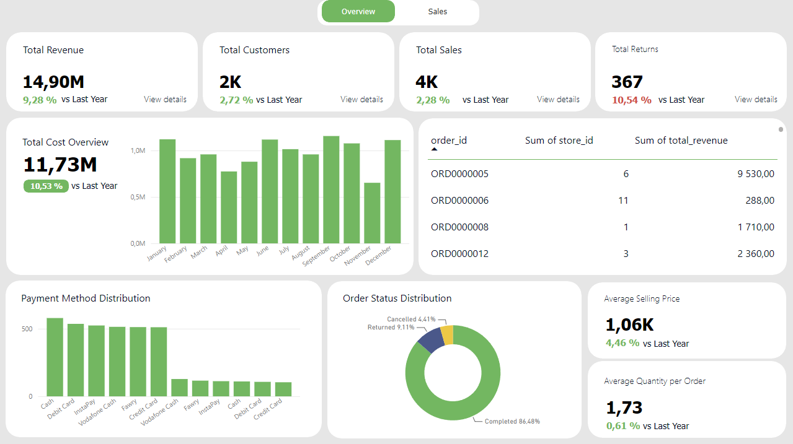
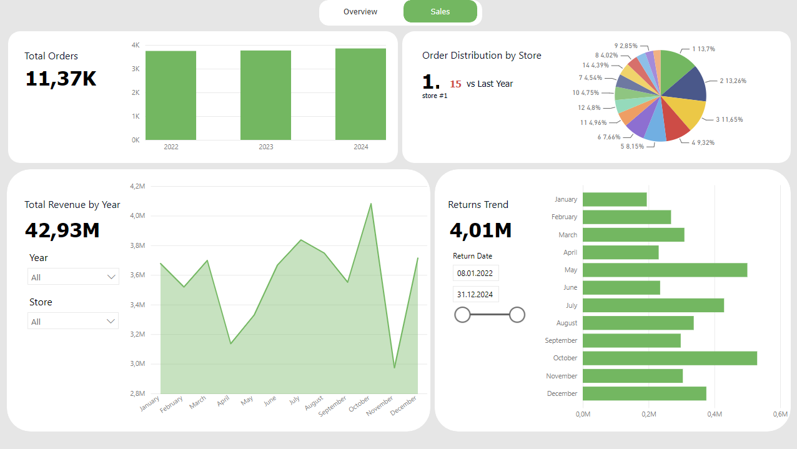

**Power BI Descriptive Dashboard: Exploring Data Through Charts and Visualizations.**  
It helps identify important trends and performance patterns across stores and years.
 ## 📈 Dashboard
 * `Overview`  
 This page provides an overview of key Order metrics, including year-over-year KPI comparisons, Payment Method distribution, Order Status distribution, and other relevant visualizations.
 

* `Sales`  
 This page provides a detailed view of Order Distribution, Revenue by Store and Year, and Return trends.
 

## 💡 Key Insights
  **Overall Performance:** KPIs in 2024 showed a slight improvement compared with 2023.  
  **Returns:** The number of returns increased by approximately **10%** compared with 2023.  
  **Order Status:** Completed orders accounted for **86%** of all orders.  
  **Average Selling Price:** The average selling price was approximately **1.06K**.    
  **Average Quantity:** Customers purchased an average of **1.7 items per order**, with most orders containing **1–2 items**.  
  **Top Store:** **Store 15** generated the largest share of orders.  

## 🧮 DAX Measures
This section contains the DAX measures created for calculating key metrics, KPIs, trends, and year-over-year comparisons.
### Page Overview
 - Total Revenue/Customers/Sales/Returns/Cost
```
  Revenue = SUM(fact_orders_2024[total_revenue])
  Active Customers = DISTINCTCOUNTNOBLANK(fact_orders_2024[customer_id])
  Sales = DISTINCTCOUNTNOBLANK(fact_orders_2024[order_id])
  Return Count =
  CALCULATE(
     DISTINCTCOUNTNOBLANK(fact_returns[order_id]),
     FILTER(fact_returns, YEAR(fact_returns[return_date]) = 2024)
  )
  Cost = SUM(fact_orders_2024[total_cost])
```
  - Year-over-Year Performance
```
  Revenue LY = CALCULATE(SUM(fact_orders_2022_2023[total_revenue]), YEAR(fact_orders_2022_2023[order_date]) = 2023)
  Revenue YoY % = 
  DIVIDE(
    [Revenue] - [Revenue LY],
    [Revenue LY]
)
```
  - Average Selling Price & Quantity per Order
```
  Average Selling Price 2024 = 
  CALCULATE(
    AVERAGE(fact_order_details[selling_price]),
    YEAR(fact_orders_2024[order_date]) = 2024
  )
```
### Page Sales
  - Creating a new Table with data from all Year
```
  Combined Table = 
  UNION(
    SELECTCOLUMNS(
        fact_orders_2022_2023,
        "Date", fact_orders_2022_2023[order_date],
        "Revenue", fact_orders_2022_2023[total_revenue],
        "Order", 1,
        "Store", fact_orders_2022_2023[store_id],
        "Source", "2022-2023"
    ),
    SELECTCOLUMNS(
        fact_orders_2024,
        "Date", fact_orders_2024[order_date],
        "Revenue", fact_orders_2024[total_revenue],
        "Order", 1,
        "Store", fact_orders_2024[store_id],
        "Source", "2024"
      )
    )
```
  - Top Store by Revenue
```
  Store with Max Revenue = 
  MAXX(
     TOPN(
        1,
        VALUES('fact_orders_2024'[store_id]),
        DISTINCTCOUNT(fact_orders_2024[order_id]),
        DESC
     ),
    'fact_orders_2024'[store_id]
  )
```

## 🗂️ Dataset
 **Data Source:** [Dataset](https://www.kaggle.com/datasets/abdelrahmanmahmoud22/lotus-group-retail-star-schema-bi?resource=download)  
 
| Table | Columns | Rows |
|---|---:|---:|
| `fact_order_details` | 10 | 25,099 |
| `fact_orders_2022_2023` | 10 | 7,942 |
| `fact_orders_2024` | 10 | 4,058 |
| `fact_returns` | 7 | 1,056 |


